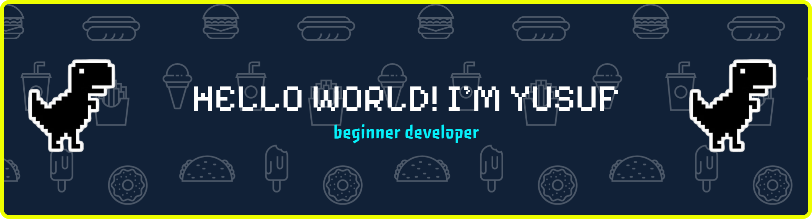

## HELLO I'M YUSUF ANDRI

<!--
**kolweoe/kolweoe** is a ✨ _special_ ✨ repository because its `README.md` (this file) appears on your GitHub profile.

Here are some ideas to get you started:

- 🔭 I’m currently working on ...
- 🌱 I’m currently learning ...
- 👯 I’m looking to collaborate on ...
- 🤔 I’m looking for help with ...
- 💬 Ask me about ...
- 📫 How to reach me: ...
- 😄 Pronouns: ...
- ⚡ Fun fact: ...
-->

- 🌱 I’m currently learning Javascript and laravel
#### Skills

  

#### My Discord

#### Contact Me
  

  
  

###

Play Games With Me

###

<picture data-importer="pacman">
  <source media="(prefers-color-scheme: dark)" srcset="https://raw.githubusercontent.com/kolweoe/kolweoe/pacman-output/galaga-contribution-graph-dark.svg?game=galaga">
  <source media="(prefers-color-scheme: light)" srcset="https://raw.githubusercontent.com/kolweoe/kolweoe/pacman-output/galaga-contribution-graph.svg?game=galaga">
  
</picture>

###